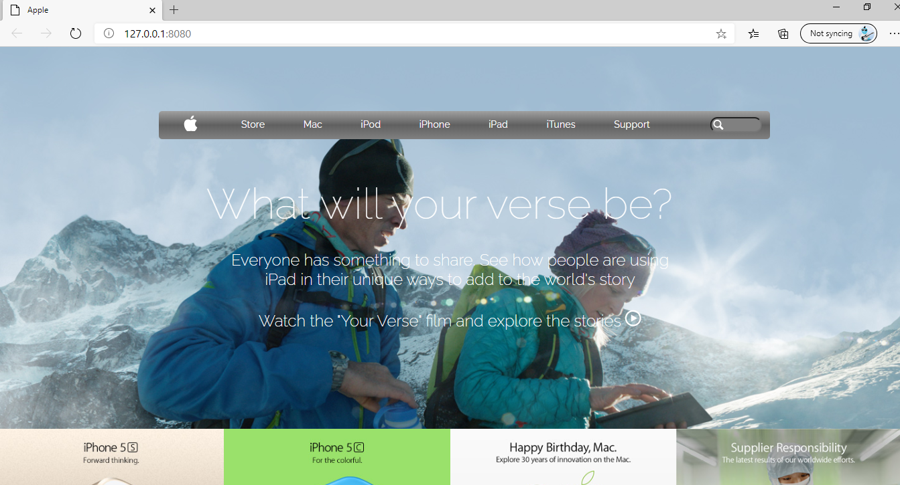

# Old Apple Webpage Clone

The Microverse "Building with Backgrounds and Gradients" practice that consist of creating a clone for the Old Apple Webpage https://web.archive.org/web/20140301004610/http://www.apple.com/. 

## Built With
- HTML
- CSS: flexbox, tables, linear-gradients and more.
- SVG's
- Google API's Font

## Authors
### Author1
- 👤GitHub: [Jose Abel Ramirez](https://github.com/jose-Abel)

## Author2
- 👤GitHub: [Daniel Ufeli](https://github.com/danielufeli)

## Getting Started
You can clone this code anytime and load the HTML on your browser, because it has SVG's needs to be loaded on a webserver so you could install the live-server package in order to display the SVG's.

## Live version
https://keen-mclean-c4488d.netlify.app/

### Setup
You can either copy the code with git clone or just do a git pull on your local environment.

### Run tests
We run the tests for the linters.yml file and everything pass!

### Acknowledgments
Appreciate the teams at Google Font's API, helps coding amazing webpages faster. Also an acknowledgment to Microverse for pushing us further to increase our knowledge.

## 📝 License
This project is MIT licensed.

## Show your support
Give a ⭐️ if you like this project!